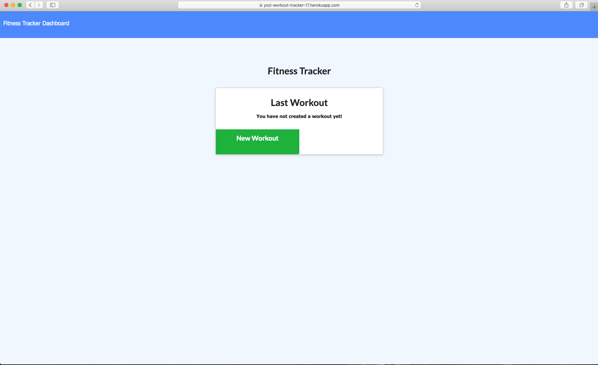

# 17-Workout-Tracker


## Description

A workout tracker has a Mongo database with a Mongoose schema and handles routes with Express.



Please visit the deployed link on [heroku](https://yozi-workout-tracker-17.herokuapp.com/).

## Table of Contents

- [Installation](#Installation)
- [Usage](#Usage)
- [License](#License)
- [Questions](#Questions)

## Installation

To install necessary dependencies, run the following command:

```
npm i
```

## Usage

When the user loads the page, they should be given the option to create a new workout, or continue with their last workout.

The user should be able to:

- Add exercises to a previous workout plan.

- Add new exercises to a new workout plan.

- View multiple the combined weight of multiple exercises on the `stats` page.

```
As a user, I want to be able to view create and track daily workouts.
I want to be able to log multiple exercises in a workout on a given day.
I should also be able to track the name, type, weight, sets, reps, and duration of exercise.
If the exercise is a cardio exercise, I should be able to track my distance traveled.
```

## License

This project is licensed under the MIT.

## Questions

If you have any questions about the repo, open an issue or contact me directly at jyzhu0101@gmail.com.

You can find more of my work at [Vulgarity2Elegance](https://github.com/Vulgarity2Elegance).
